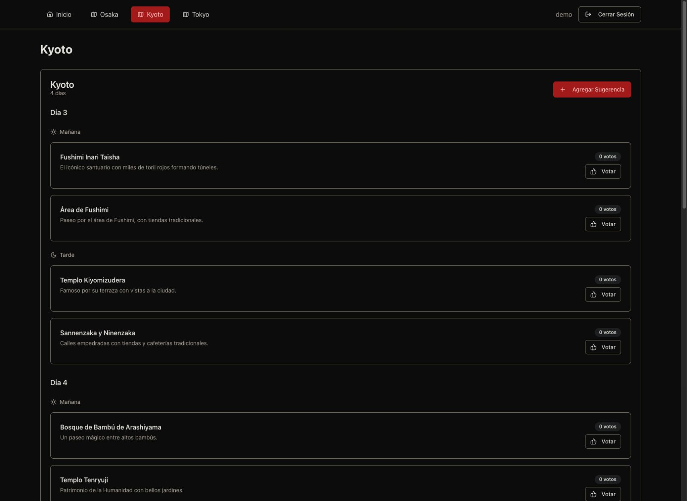
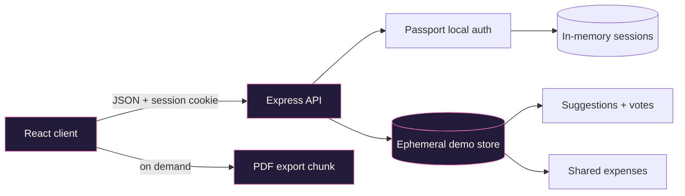

# Japan Travel Planner

[](https://github.com/Arreketefo/JapanTravelPlanner/actions/workflows/ci.yml)
[](https://nodejs.org/)
[](LICENSE)

**A collaborative itinerary workspace for turning a group trip to Japan into
one shared, actionable plan.**

Japan Travel Planner organizes a multi-city itinerary across Osaka, Kyoto and
Tokyo. Travellers can suggest places, vote on ideas, track shared expenses and
export the current plan as a PDF.



## Product highlights

- Day-by-day morning and afternoon planning for three cities.
- Collaborative suggestions with simple group voting.
- Shared expense tracking in yen with a euro estimate.
- Optional trip countdown configured through the environment.
- On-demand PDF export, loaded separately from the main application bundle.
- Responsive React interface built from accessible Radix primitives.
- Session-based demo access with rate-limited login attempts.

## Architecture



The public demo intentionally uses an in-memory store. Data resets when the
server restarts, which keeps the deployment simple and prevents the repository
from pretending that an unused database layer provides persistence. A durable
database adapter can be introduced behind the existing storage interface when
the product requires it.

## Security model

- No account credential is stored in the repository.
- Production requires `APP_USERNAME`, `APP_PASSWORD` and `SESSION_SECRET`.
- Passwords are transformed with salted `scrypt` before entering memory.
- API responses expose only public user fields; password hashes are never
  returned or written to request logs.
- Login attempts are rate limited.
- Session cookies are HTTP-only, SameSite and secure in production.
- Helmet applies production security headers.
- Suggestion links accept only absolute HTTP or HTTPS URLs.

This is a portfolio demo, not a multi-tenant travel service. See
[`SECURITY.md`](SECURITY.md) before deploying it on a public network.

## Stack

React 18 · TypeScript · Vite · TanStack Query · Express · Passport · Zod ·
Tailwind CSS · Radix UI · React PDF

## Run locally

Requirements: Node.js 20+ and npm.

```bash
git clone https://github.com/Arreketefo/JapanTravelPlanner.git
cd JapanTravelPlanner

cp .env.example .env
npm ci
npm run dev
```

The example environment provides a local-only demo account. Replace every
placeholder before exposing the app outside your machine.

Open [http://localhost:5000](http://localhost:5000).

## Quality gates

```bash
npm run check   # strict TypeScript validation
npm test        # authentication and input-schema tests
npm run build   # production client + server bundles
npm run ci      # all of the above
npm audit --omit=dev
```

The main interface ships separately from the heavy PDF renderer. The PDF chunk
is fetched only after the user asks to prepare an export.

## Environment

| Variable | Required in production | Purpose |
| --- | --- | --- |
| `APP_USERNAME` | Yes | Single demo account username |
| `APP_PASSWORD` | Yes | Demo password; never committed |
| `SESSION_SECRET` | Yes | Session signing secret, minimum 32 characters |
| `VITE_TRIP_START_DATE` | No | ISO 8601 date shown by the countdown |
| `PORT` | No | HTTP port; defaults to `5000` |

## Project structure

```text
client/          React application and UI components
server/          Express API, authentication and ephemeral storage
shared/          Runtime validation schemas and shared TypeScript types
.github/         CI and dependency update configuration
```

## Roadmap

- Replace the ephemeral store with a tested PostgreSQL adapter if persistence
  becomes a product requirement.
- Add browser-level tests for the main planning journey.
- Make trip dates, cities and currency conversion configurable per itinerary.
- Generate real coordinates before reintroducing an interactive map.

## Contributing

See [`CONTRIBUTING.md`](CONTRIBUTING.md). Bug reports and examples must use
synthetic itineraries and must not contain real credentials or booking data.

## License

Licensed under the [Apache License 2.0](LICENSE).
